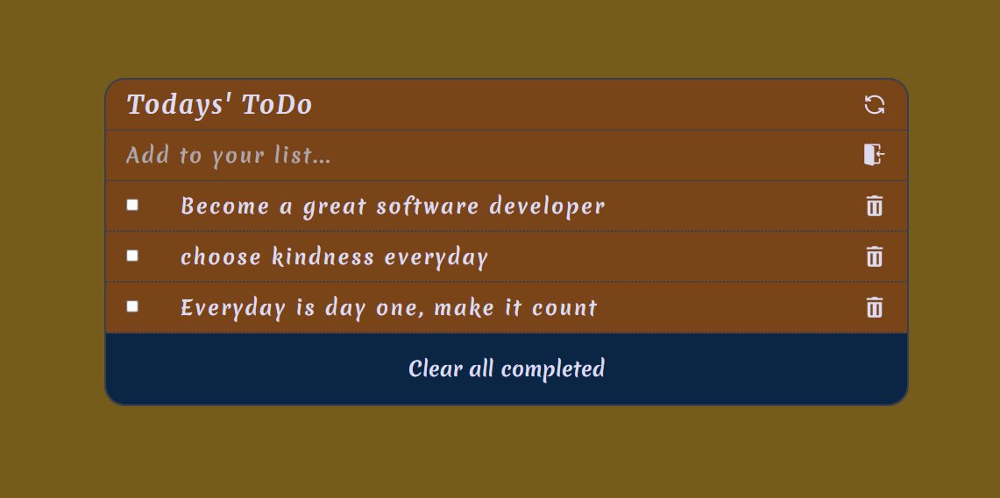

# ToDo-List App

> A web app to keep track of your important tasks

## Built With

- Major languages: HTML, CSS, JavaScript
- Frameworks: N/A
- Technologies used: Webpack

#### You can view the live version [here](https://deyemiobaa.github.io/ToDo-List/)



### Prerequisites

- Understand HTML/CSS and JavaScript

### Install

- A code editor (preferably VSCode)
- A browser
- Node.js (to run javascript files locally)
- LiveServer (to load javascript modules)

## Getting Started

To get a local copy up and running follow these simple example steps.
- Open git bash on local computer
- clone the repo with: 
```
git clone  <https://github.com/deyemiobaa/ToDo-List.git>
```
- run ```cd ToDo-List``` to enter the project folder
- run ```npm i``` to install all dependencies
- run ```npm run build``` to bundle the project with webpack, and
- run ```npm start``` to launch the application

## Author

- GitHub: [@deyemiobaa](https://github.com/deyemiobaa)
- Twitter: [@deyemiobaa](https://twitter.com/deyemiobaa)
- LinkedIn: [LinkedIn](https://linkedin.com/in/sodiqa)


## 🤝 Contributing

Contributions, issues, and feature requests are welcome!

Feel free to check the [issues page](https://github.com/deyemiobaa/ToDo-List/issues).

## Show your support

Give a ⭐️ if you like this project!

## 📝 License

This project is [MIT](LICENSE) licensed.
